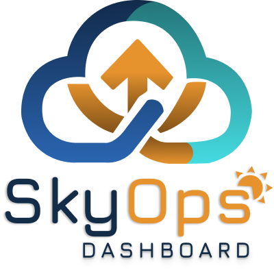
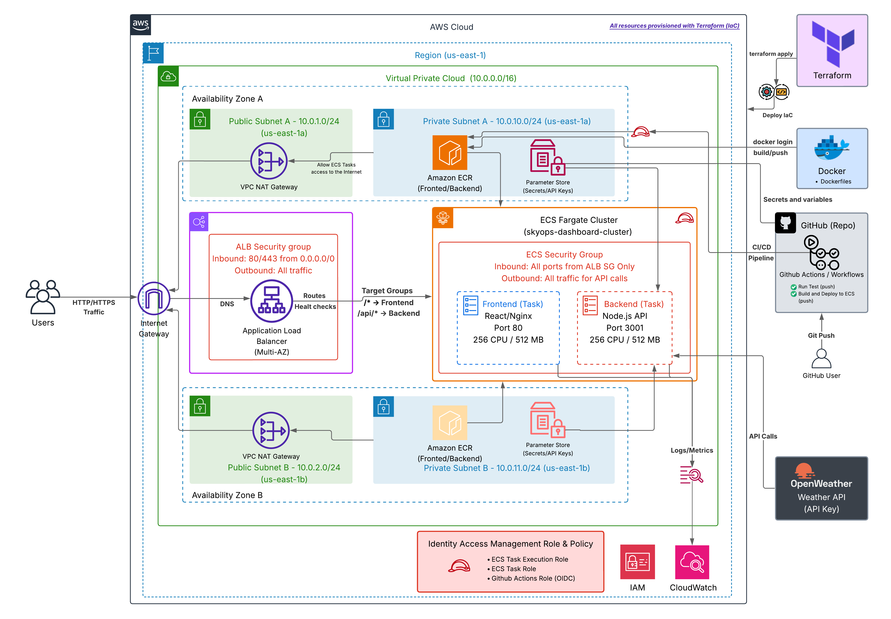
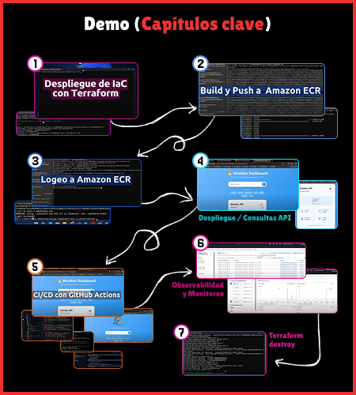
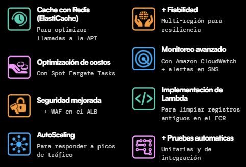

<!-- # SkyOps Dashboard – CI/CD + AWS + IaC -->

<!--  -->

<div align="center">
  
</div>


 
[](https://github.com/luismotaiv/skyops-dashboard-aws-cicd)
[](https://opensource.org/licenses/MIT)


---

## 📑 Tabla de Contenidos
1. [📌 Descripción](#-descripción)
2. [🏗️ Arquitectura](#️-arquitectura)
3. [📹 Demo](#️-demo)
4. [🚀 Tecnologías Utilizadas](#-tecnologías-utilizadas)
5. [⚙️ Instalación y Ejecución](#️-instalación-y-ejecución)
   - [🔹 Ejecución Local con Docker Compose](#-1-ejecución-local-con-docker-compose)
   - [🔹 Despliegue en AWS con Terraform](#-2-despliegue-en-aws-con-terraform)
6. [🔐 Variables de Entorno](#-variables-de-entorno)
7. [📊 CI/CD con GitHub Actions](#-cicd-con-gitHub-actions)
8. [🌟 Posibles Mejoras](#-posibles-mejoras)
9. [🤝 Contributing](#-contributing)
10. [👤 Autor](#-autor)
11. [🔗 Contacto](#-contacto)
<!-- 10. [📚 Créditos y Recursos](#-créditos-y-recursos) -->

---

## 📌 Descripción  

**SkyOps Dashboard** es una aplicación web que muestra información del clima en tiempo real utilizando la API de **[OpenWeatherMap](https://openweathermap.org/)**.  

Este proyecto fue desarrollado como parte del programa **AWS re/Start**, con el objetivo de aplicar **conceptos prácticos de DevOps en la nube**, como:  

- **Infraestructura como Código (IaC)** con **Terraform** (TODO el stack se levanta con Terraform: Networking (VPC, Subnets, NAT Gateway, Route Tables), ECS, ALB, ECR, IAM, CloudWatch, SSM).  
- **Contenedores Docker** desplegados en **Amazon ECS Fargate**.  
- **Automatización CI/CD** con **GitHub Actions**.  
- **Balanceo de carga y escalabilidad** con **Application Load Balancer (ALB)**.  
- **Logs centralizados y observabilidad** con **Amazon CloudWatch**.  
 
---

## 🏗️ Arquitectura  

La arquitectura fue diseñada con un enfoque **moderno, escalable y costo-eficiente**:  

- **Usuarios** acceden al dashboard mediante un **ALB**.  
- **Frontend y Backend** corren en **Amazon ECS Fargate** dentro de un **ECS Cluster**.  
- Las imágenes se almacenan en **Amazon ECR**.  
- **GitHub Actions** maneja CI/CD.  
- **Terraform** despliega automáticamente:  
  - VPC, Subnets, Security Groups  
  - ECS Cluster + Services (Frontend/Backend)  
  - ALB + Target Groups  
  - Repositorios en ECR  
  - Roles de IAM y permisos  
  - Parámetros en SSM  
  - Logs en CloudWatch  

Arquitectura:  


<!-- p align="center">
  
</p -->

---

## Demo
 

👉 [**Demo en YouTube**](https://youtu.be/71m9qDdAGVk?si=qWp-Y8vHRBonz0E6)  

<!--  -->

<div align="center">
  
</div>

---

## 🚀 Tecnologías Utilizadas  

- **Frontend**: React + Nginx 
- **Backend**: Node.js + Express + Axios 
- **Infraestructura**: Terraform  
- **Contenedores**: Docker + Docker Compose  
- **Cloud Provider**: AWS (ECS Fargate, ECR, ALB, CloudWatch, IAM, VPC, Subnets)  
- **CI/CD**: GitHub Actions  
- **API de Datos**: OpenWeather API  

---

## ⚙️ Instalación y Ejecución  

### 🔹 1. Ejecución Local con Docker Compose  
#### **ℹ️ Requerimientos:** 
- Debes tener instalado [**Docker**](https://www.docker.com/pricing/) 🐳.
- Configura las [**variables de entorno**](#-local) locales 🔒.

Clona el repositorio y ejecuta:  

```bash
git clone https://github.com/luismotaiv/skyops-dashboard-aws-cicd.git

cd skyops-dashboard-aws-cicd

docker-compose up --build
```

La app quedará disponible en:
- 👉 Frontend: http://localhost:80
- 👉 Backend: http://localhost:3001

---
### 🔹 2. Despliegue en AWS con Terraform

#### **ℹ️ Requerimientos:** 
- Debes tener instalado **[AWS CLI](https://docs.aws.amazon.com/es_es/streams/latest/dev/setup-awscli.html)** ⚙️, **[Terraform](https://developer.hashicorp.com/terraform)** 🛠️ y **[Docker](https://www.docker.com/pricing/)** 🐳
- Configura las [**variables de entorno**](#-en-la-nube-de-aws-iac--cicd) para despliegue en la nube 🔒☁️.

***1.*** Autentícate en AWS CLI.

***2.*** Clona el repositorio: 
    
```bash
git clone https://github.com/luismotaiv/skyops-dashboard-aws-cicd.git
```

***3.*** Posiciónate en la carpeta proyecto/terraform
```bash
cd skyops-dashboard-aws-cicd/terraform
```

***4.*** Ejecuta:
```bash
terraform init
terraform fmt
terraform validate
terraform plan
terraform apply
```

***5.*** Construye y sube las imágenes a Amazon ECR:
- Sustituye **<REGION_AWS>** y **<AWS_ACCOUNT_ID>** por la región dónde estás trabajando y el ID de tu cuenta AWS.

#### Login a Amazon ECR 🔐
```bash
aws ecr get-login-password --region <REGION_AWS> | docker login --username AWS --password-stdin <AWS_ACCOUNT_ID>.dkr.ecr.<REGION_AWS>.amazonaws.com

# Login con Token (Sí falla el comando anterior)
# Obtener el token
aws ecr get-login-password --region <REGION_AWS>
docker login --username AWS --password [TOKEN_AQUI] <AWS_ACCOUNT_ID>.dkr.ecr.<REGION_AWS>.amazonaws.com
```

#### Posiciónate en la carpeta Backend (Build and Push) 📦🚀
```bash
cd ../backend

docker build -t <AWS_ACCOUNT_ID>.dkr.ecr.<REGION_AWS>.amazonaws.com/skyops-dashboard-backend:latest .
docker push <AWS_ACCOUNT_ID>.dkr.ecr.<REGION_AWS>.amazonaws.com/skyops-dashboard-backend:latest
```

#### Posiciónate en la carpeta Frontend (Build and Push) 📦🚀
```bash
cd ../frontend

docker build -t <AWS_ACCOUNT_ID>.dkr.ecr.<REGION_AWS>.amazonaws.com/skyops-dashboard-frontend:latest .
docker push <AWS_ACCOUNT_ID>.dkr.ecr.<REGION_AWS>.amazonaws.com/skyops-dashboard-frontend:latest
```
`docker build` → Construye la imagen localmente en tu máquina (Puedes verlos en el apartado Builds de Docker Desktop).

`docker push` → Sube esa imagen al repositorio de ECR (el "DockerHub" privado de AWS).

📌 Después, ECS (con Fargate) es quien usa esas imágenes desde ECR para levantar los contenedores y ejecutarlos en los tasks.

***6.*** Recupera o ejecuta la **_URL_** de la Aplicación (Endpoint):
```bash
# Directo
terraform output alb_dns_name

# Recupera los outputs de terraform 
terraform output
```
***7.*** ¡Listo! SkyOps Dashboard esta desplegado exitosamente ⛅🚀

- Navega por la **consola de administracion de AWS** para ver los recursos desplegados.

- **Realiza consultas** en SkyOps Dashboard.

***8.*** Cuando lo desees **destruye los recursos desplegados en AWS** con:
```bash
terraform destroy
```
---

## 🔐 Variables de Entorno
- Requiere cuenta, consigue tu API Key gratuita en **[OpenWeatherMap](https://openweathermap.org/)**.

### 📌 Local

#### Crear un archivo `.env` en la raíz con:
```bash
OPENWEATHER_API_KEY=your_api_key_here
```

### 📌 En la nube de AWS (IaC - CI/CD)

#### 1. En tu repositorio de GitHub, configurar los siguientes ***secrets***: 

 - `AWS_ACCOUNT_ID` → ID de tu cuenta AWS

- `AWS_ROLE_ARN` → ARN del rol IAM usado por GitHub Actions

- `OPENWEATHER_API_KEY` → Tu API key de OpenWeather

#### 2. En <ins>.github/workflows</ins>, en el archivo [deploy.yml](.github/workflows/deploy.yml) modifica las siguientes variables (env):

 - `AWS_REGION` → Poniendo ahora la ***region de AWS*** en dónde trabajarás ([**ir a variable**](https://github.com/luismotaiv/skyops-dashboard-aws-cicd/blob/2c96a0f8faf6dcf49ef26c8f958dd2f19dc3307d/.github/workflows/deploy.yml#L10)).

 - `ECR_REGISTRY` → Sustituyendo de igual forma la ***region*** ([**ir a variable**](https://github.com/luismotaiv/skyops-dashboard-aws-cicd/blob/2c96a0f8faf6dcf49ef26c8f958dd2f19dc3307d/.github/workflows/deploy.yml#L11)).

#### 3. En <ins>terraform</ins>, en el archivo [variables.tf](terraform/variables.tf) modifica las siguientes variables:

 - `github_repository` → Poniendo ahora el ***nombre de tu repositorio*** ([**ir a variable**](https://github.com/luismotaiv/skyops-dashboard-aws-cicd/blob/2c96a0f8faf6dcf49ef26c8f958dd2f19dc3307d/terraform/variables.tf#L15)).

 - `aws_region` → Poniendo ahora la ***region de AWS*** en donde trabajarás ([**ir a variable**](https://github.com/luismotaiv/skyops-dashboard-aws-cicd/blob/2c96a0f8faf6dcf49ef26c8f958dd2f19dc3307d/terraform/variables.tf#L3)).

---

## 🔄 CI/CD con GitHub Actions

#### Puedes revisar la confuguracion en [**Pipeline**](.github/workflows/deploy.yml) detalladamente.
#### Flujo de **jobs** del Pipeline:
  - [x]  `Run Tests (push)` → Test & Linting de **Backend y Frontend**
  - [x]  `Build and Deploy to ECS (push)` → ***Build & Push*** de Imágenes a **ECR**.

---

#### Flujo **CI/CD**:
* Cada push en GitHub dispara un workflow en GitHub Actions.
* Se construyen imágenes Docker y se suben a Amazon ECR.
* Se actualiza la definición de tareas en ECS Fargate.
* El usuario obtiene la nueva versión en producción sin intervención manual.

**ℹ️ Puedes realizar pruebas `Push` hacia tu reporsitorio**

---

## 🌟 Posibles Mejoras
<!--  -->

<div align="center">
  
</div>

--- 

## 🤝 Contributing

¡Las contribuciones son bienvenidas! 🙌

- Para colaborar:
1. Haz un fork del repositorio.

2. Crea una rama para tu feature/bugfix:
```bash
git checkout -b feature/nueva-funcionalidad
```
3. Haz commit de tus cambios:
```bash
git commit -m "Agrega nueva funcionalidad"
```
4. Sube tu rama:
```bash
git push origin feature/nueva-funcionalidad
```
5. Abre un Pull Request 🚀

---

## 👤 Autor

- [@luismotaiv](https://www.github.com/luismotaiv)

---

## 🔗 Contacto
[](https://luismotaiv.vercel.app/)
[](https://www.linkedin.com/in/luismotaiv/)
